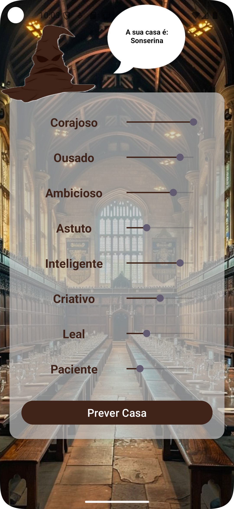

# Previsão da Casa de Hogwarts

## Descrição  
Este aplicativo Android prevê a casa de Hogwarts de um usuário com base em suas características definidas por meio de barras deslizantes (SeekBars). Ele utiliza um modelo TensorFlow Lite (TFLite) treinado para classificar os usuários em uma das quatro casas: Grifinória, Sonserina, Corvinal e Lufa-Lufa.

## Treinamento do Modelo  
O modelo de previsão da casa de Hogwarts foi treinado utilizando dados sintéticos gerados com a biblioteca **NumPy**. Esses dados foram criados a partir de um estudo das características típicas de cada casa de Hogwarts, como coragem, ambição, inteligência, lealdade e outros traços associados a cada casa.

### Geração dos Dados Sintéticos:
- **NumPy** foi utilizado para gerar um conjunto de dados com valores aleatórios para as características de cada casa.
- Cada casa foi associada a um conjunto de características específicas, com base nas descrições de cada casa no universo de Harry Potter.
- Esses dados foram então usados para treinar o modelo de classificação para prever a casa de Hogwarts de um usuário com base nas suas respostas.

## Funcionalidades  
- Permite que o usuário insira valores de características como coragem, ambição, criatividade, etc., usando SeekBars.  
- Realiza inferência no modelo TFLite para prever a casa de Hogwarts.  
- Exibe a casa prevista na interface do aplicativo.

## Tecnologias Utilizadas  
- **Python**: Usado durante o treinamento do modelo.
- **NumPy**: Usado para gerar dados sintéticos para o treinamento do modelo.
- **Android**: Desenvolvimento do aplicativo.  
- **TensorFlow Lite**: Modelo de Machine Learning para classificação.  
- **Java**: Linguagem de programação principal.

## Como Funciona  
1. O usuário ajusta os valores de cada característica usando as SeekBars.  
2. Os valores são normalizados e enviados como entrada ao modelo TensorFlow Lite.  
3. O modelo retorna uma matriz com as probabilidades das casas.  
4. O aplicativo interpreta a saída para determinar a casa com maior probabilidade.  

## Telas

  
  

